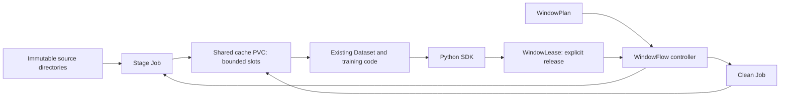

# WindowFlow Operator

WindowFlow stages a sequence of dataset directories into a bounded number of slots on a shared Kubernetes PVC. Training reads the current window while a worker prepares another. The operator reclaims a window only after **every declared reader explicitly releases it**.

The intended use is a large, immutable dataset in object storage, a smaller shared training filesystem, and a training job that can sample within one data window at a time. The first implementation supports local PVC-to-PVC copying and Alibaba Cloud CPFS data-flow import. Video files can remain in their existing directory structure; no dataset format conversion is required.

[简体中文](README.zh-CN.md) · [Architecture](docs/architecture.md) · [Operations](docs/operations.md) · [Contributing](CONTRIBUTING.md)

**Status: experimental v0.1.** This is a reference implementation, not a production storage service. There is no PB-scale, real ACK/CPFS, or PPU production validation. The CPFS backend requires a real-environment smoke test. The Python SDK and examples do not provide complete Megatron checkpoint recovery. The planned image is `ghcr.io/iampengqian/windowflow-operator:v0.1.0`; this documentation does not assert that a published image is available. Build the image locally until a successful registry build is verified.

## What it does

- Reserves up to `slots` directories and `capacityBytes` logical content bytes for one training attempt.
- Runs `stage` and `clean` as Kubernetes Jobs using the same binary as the controller.
- Publishes a slot as `Ready` only after staging succeeds and the file-byte count matches `expectedBytes`.
- Uses immutable plan identity, window ordinal, and generation to keep stale reader releases from authorizing cleanup.
- Gives Python training code explicit `acquire(index)` and `release(handle)` operations. There are no Kubernetes calls per sample.
- Fails closed: a missing reader, failed worker, or timeout does not authorize deleting data.

One active plan exclusively owns one cache PVC. v0.1 does not implement shared cache across jobs, elastic reader membership, automatic inventory, arbitrary CSV manifests, global random sampling, or automatic recovery of a failed training attempt. `capacityBytes` is a scheduling budget, **not a filesystem quota**.

## How the pieces fit



`WindowPlan` describes the fixed windows and readers. A `WindowLease` records one reader's use of one window generation. The operator does not infer training progress from file access, process liveness, or elapsed time.

## One-command local demonstration

With Docker, kind, and kubectl installed, run `./scripts/kind-smoke.sh`. It creates a disposable single-node cluster, builds the operator and SDK-reader images, prepares tiny files, and runs two readers through three windows on two slots. It removes its own cluster on exit; set `KEEP_CLUSTER=1` to inspect it. No GPUs or cloud credentials are needed. The script refuses to replace an existing cluster of the same name.

## Build and deploy

Prerequisites:

- Go 1.26 and the build tools used by the Makefile; Python 3.10 or newer for the SDK.
- A Kubernetes 1.32+ cluster, `kubectl`, and permission to install CRDs and the controller's RBAC.
- A container builder and a registry reachable by the cluster, or an image-loading mechanism for a local cluster.
- A cache PVC that every reader and worker can mount. Multi-node training normally needs shared storage supporting the required simultaneous mounts. For the local backend, use a **different** source PVC.

```sh
git clone https://github.com/iampengqian/windowflow-operator.git
cd windowflow-operator
make test
make manifests
make build

docker build -t ghcr.io/iampengqian/windowflow-operator:v0.1.0 .
# Push to a registry you control, or load into your local cluster.
# For a kind cluster, for example:
kind load docker-image ghcr.io/iampengqian/windowflow-operator:v0.1.0

kubectl apply -k config/default
pip install ./sdk/python
```

For a registry with a different image name, update both the controller image in the deployment configuration and `spec.workerImage` in your plan. A controller image change does not change the worker image declared by an existing immutable plan. Check that the cluster can pull the image before submitting work.

The binary has three subcommands: `windowflow manager`, `windowflow stage`, and `windowflow clean`. Worker Jobs receive their configuration through `WINDOWFLOW_WORKER_CONFIG`; ordinary training clients do not invoke these subcommands directly.

### Start with the local backend

Use [config/samples/local-plan.yaml](config/samples/local-plan.yaml) for an inexpensive storage and coordination smoke test before connecting CPFS.

1. In namespace `default`, create a writable cache PVC named `training-cache` and a distinct source PVC named `source-data`, using a suitable StorageClass.
2. Populate the source PVC with the exact directories and file sizes declared by the sample. `expectedBytes` is the sum of regular-file content sizes, not allocated disk blocks or directory sizes. Treat the source as immutable after submission.
3. Ensure UID/GID `1000:1000`, used by worker containers, can read the source and write to the cache. See [storage preparation](docs/operations.md#storage-preparation).
4. Apply the plan and watch its status:

```sh
kubectl apply -f config/samples/local-plan.yaml
kubectl get windowplans -n default -w
kubectl get jobs -n default
```

The sample is named `local-demo` and declares readers `dp0` and `dp1`. Both must acquire and explicitly release each window. If only one participates, retention is intentional. The local backend verifies safe relative paths, rejects symlinks and special files, and never deletes the source PVC.

### Connect a reader

Install the SDK in the training image and mount the cache PVC at `/cache`. The base install keeps Kubernetes optional for dependency-injected tests; a live client also needs the extra:

```sh
pip install "./sdk/python[kubernetes]"
```

The training service account needs the permissions described in [operations](docs/operations.md#training-service-account). Create one client in the coordinating reader process; do not pass the client into DataLoader workers.

```python
from windowflow import WindowClient

client = WindowClient(
    plan_name="local-demo",
    namespace="default",
    reader_id="dp0",  # use dp1 for the second declared reader
    mount_path="/cache",
)

for window_index in range(3):
    handle = client.acquire(window_index)
    # handle.root is a pathlib.Path containing this window's staged files.
    # Open your existing Dataset here; run training for this window.
    # Before release, stop its iterator and drain/close every DataLoader
    # worker, decoder, prefetch queue, and outstanding asynchronous read.
    client.release(handle)
```

The comments above mark the training integration you must implement; this loop alone performs no training. Do not put `release()` in a blanket `finally` block. An exception may leave readers active, and release is permission to reclaim their files. A timeout leaves the lease unreleased. A released window cannot be reacquired in the same plan attempt.

For Megatron with TP/PP, preserve the existing video Dataset, sampling, and `get_batch`/broadcast behavior. Integrate at a coordinated window boundary. Assign a unique reader ID to **each process that actually opens files**, including additional TP/PP readers. Use Megatron's DP rank for sample sharding; a lease ID is a separate identity. A single coordinator ID may represent multiple processes only if your platform explicitly waits for every covered file reader to stop. The SDK performs no distributed collectives.

### Use CPFS data flows

[config/samples/cpfs-plan.yaml](config/samples/cpfs-plan.yaml) is a configuration template. Before applying it:

- Create the CPFS filesystem, mount it through your PVC, and configure its OSS data flow separately.
- Set the actual region, filesystem/data-flow IDs, data-flow filesystem root, PVC filesystem root, immutable source directories, and exact expected byte counts.
- Create the namespace-local credentials Secret without committing its values. It uses `ALIBABA_CLOUD_ACCESS_KEY_ID`, `ALIBABA_CLOUD_ACCESS_KEY_SECRET`, and optionally `ALIBABA_CLOUD_SECURITY_TOKEN`.
- Verify that `pvcPath` is the real filesystem path represented by the PVC and is inside `fileSystemPath`. Neither field means the container mount `/cache`.

The backend requests a directory import with data and metadata, polls the provider task, and verifies imported content bytes before exposing the slot. It does not create the data flow, discover the source inventory, or consume CSV object lists. Read [CPFS setup and smoke testing](docs/operations.md#cpfs-setup) before using real training data.

## Capacity and training semantics

For 2 PB divided into ten equal 200 TB windows, a two-slot plan needs up to 400 TB of logical cached file data, plus independent filesystem margin. This decimal arithmetic is an illustration, not a sizing guarantee. Directory sizes, checkpoints, metadata, delayed cleanup, and other PVC contents affect physical use.

To avoid a stall, preparation of the next window must finish before training needs it. Measure import bandwidth **while training is reading the same filesystem** and include cleanup, task startup, validation, and retry margin. The first window always has a cold-start cost.

Sampling randomly inside a window does not reproduce a global shuffle over the full dataset. Build representative windows and evaluate the effect of the window schedule on convergence. WindowFlow manages file availability; it does not choose examples or validate training quality.

## Failure behavior

A failed stage/clean Job freezes the plan. Missing releases block reclamation. Deleting a plan does not release its PVC lock or prove that files are unused. Recovery requires an operator to verify that all training readers and provider operations have stopped, clean the affected owned directories safely, and only then release the lock for a new plan. See the [recovery runbook](docs/operations.md#failure-and-recovery).

Saving a model checkpoint does not release a window, and releasing a window does not save sample progress. Store window ordinal, sampler state, and any model-specific progress in your training checkpoint. After fencing the old attempt, create a new plan with the same immutable schedule and `spec.startWindow` set to the checkpoint window ordinal. Set the SDK/example start index to that same ordinal. The operator skips earlier windows; the training platform must restore the within-window sample offset and RNG state. `completedWindows` counts only windows cleaned in this attempt. Complete reproducible Megatron restart integration is outside v0.1.

See the [Megatron integration sketch](examples/megatron_adapter.py) and [CPU file-reader demonstration](examples/train_local.py).

## Development and attribution

Run `make test`, `make manifests`, and `make build` from the repository root. See [CONTRIBUTING.md](CONTRIBUTING.md) for the required evidence in pull requests. Passing unit tests is not evidence of a successful live CPFS deployment.

The rolling-window idea is informed by [MONAI SmartCacheDataset](https://github.com/Project-MONAI/MONAI/blob/dev/monai/data/dataset.py). MONAI caches transformed objects in process memory; this project coordinates directory residency on a shared PVC. No MONAI source is copied.

Licensed under [Apache License 2.0](LICENSE). Please report security concerns according to [SECURITY.md](SECURITY.md).
