# Architecture

WindowFlow separates file residency from training sample selection. A directory window is the unit of staging and reclamation. The existing Dataset opens ordinary files below the root returned by the SDK; the operator does not decode videos or participate in minibatch construction.

This document describes the experimental v0.1 contract. It is not evidence of PB-scale or live CPFS validation.

## Resources and identity

Both CRDs are namespaced and use `data.windowflow.io/v1alpha1`.

| Resource | Purpose | Mutation rules |
| --- | --- | --- |
| `WindowPlan` | One fixed sequence of windows for one distributed training attempt | The spec is immutable; the controller writes status. |
| `WindowLease` | One reader's permission to use one specific window generation | Identity fields are immutable; `released` can only move from `false` to `true`. |
| Kubernetes `Lease` | Exclusive ownership of the cache PVC by a plan | Retained for the plan lifetime; never stolen because time elapsed. |

The Kubernetes coordination Lease is separate from the custom `WindowLease`. It has no owner reference that would remove the lock when a plan is deleted. Completed plans release the lock after cleanup; failed or deleted plans require manual recovery.

A window instance is identified by `(plan UID, window index, generation)`. A reader lease additionally identifies `readerID`. Plan names are not sufficient because Kubernetes can reuse a name after deletion. The SDK pins the first observed plan UID and rejects a replacement plan with the same name.

Lease object names are deterministic: `wl-` plus the first 40 hexadecimal characters of SHA-256 over the newline-separated plan UID, reader ID, decimal window index, and generation. A conflicting object must match the entire tuple; its name alone is not trusted.

## Reservation and staging

The plan declares an ordered array of relative source directories with exact `expectedBytes`. The controller schedules windows in order, subject to slot count and the sum of reserved bytes. Reservations remain occupied until successful cleanup. `capacityBytes` does not measure free blocks, impose a filesystem quota, or account for unrelated files.

`slots` permits 2–64 slots. `maxConcurrentLoads` defaults to 1 and limits concurrent staging rather than reader count. `jobTimeoutSeconds` defaults to 604800 seconds (seven days); reaching a Job deadline is a failure, not proof that remote provider work has stopped or that the directory can be reclaimed.

Each slot has an index and a window generation, with a destination below:

```text
<cache mount>/windowflow/<plan UID>/<generation>/
```

The controller starts a deterministic stage Job. Jobs use the plan's `workerImage`, mount the cache PVC at `/cache`, and receive structured JSON through `WINDOWFLOW_WORKER_CONFIG`. Local jobs additionally mount a distinct source PVC read-only at `/source`. Worker containers run as UID/GID `1000:1000`.

```mermaid
stateDiagram-v2
    [*] --> Loading: reserve slot and bytes
    Loading --> Ready: stage Job succeeds
    Loading --> Failed: stage Job fails
    Ready --> Reclaiming: all declared readers explicitly released
    Reclaiming --> [*]: clean Job succeeds; free reservation
    Reclaiming --> Failed: clean Job fails
```



Plan status is `Pending`, `Running`, `Completed`, or `Failed`. A slot's failure freezes the plan rather than freeing its capacity for another window.

## Backend boundary

The local backend copies regular files from an immutable relative source directory. It rejects traversal, symlinks, special files, and detectable source mutation. It checks the total source bytes before copying. The destination ownership marker binds its directory to a specific plan UID and generation. A retry may only reuse a matching owned destination.

The CPFS backend imports a source directory through an existing data flow using `Import`, `MetaAndData`, `Directory`, `DstDirectory`, and a deterministic client token. Destination mapping uses the data-flow filesystem root and the actual filesystem root exposed by the PVC. A PVC root outside the data-flow root is rejected. The backend polls task completion, treats partial failure as failure, and checks the imported regular-file byte count before success. No nonempty staging-directory rename is required.

Byte counts detect missing or extra content size; they are not cryptographic content verification. Sources must be trusted and immutable. CPFS provider behavior and path mapping must be validated with a live smoke test.

Clean Jobs operate only on a generation directory with the matching ownership marker, reject unsafe paths, and never delete the PVC or source data. Stage and clean are separate operations; an import failure does not authorize cleanup.

## Reader protocol

1. The SDK validates plan identity, reader membership, and the requested index.
2. It waits for the matching slot to be `Ready`, then creates or verifies its deterministic `WindowLease` before returning a handle.
3. Training reads from `handle.root`, a `pathlib.Path` below the cache mount.
4. Training completes its boundary, drains all covered loaders/decoders/readers, and explicitly calls `release(handle)`.
5. The controller requires a released lease from **every** declared reader for that exact window identity before starting cleanup.

An absent lease blocks cleanup. Unknown readers and mismatched UIDs, generations, or indices never count. There is no expiry that implies release. A released lease cannot be reacquired, so every plan is a single training attempt with a fixed membership and progression policy.

The SDK does not automatically release on exceptions or iterator advancement. It does not issue distributed collectives. Python context exit, worker termination, and API timeout are not proofs that all file consumers have stopped.

## Megatron integration boundary

The adapter boundary is the selection of the current window root and the training boundary at which that root may change. Keep the original video Dataset, decoding, sample construction, Megatron samplers, and `get_batch`/TP broadcast path.

Reader membership must reflect the actual data-loading topology. A DP replica can have one logical reader ID only when its release accounts for every TP/PP participant and asynchronous reader relying on those files. Do not attach a generic `DistributedSampler` over global ranks merely to match `spec.readers`.

A safe boundary must cover outstanding microbatches, pipeline work, DataLoader prefetch, decoder threads/processes, and open asynchronous reads. A training barrier alone does not close these consumers. The integration example illustrates this responsibility; it is not a complete Megatron recovery adapter.

The training checkpoint must independently record window ordinal, sampler/RNG state, and model-specific progress. Neither a lease nor the plan's `completedWindows` reconstructs which samples contributed to a committed optimizer step.

## Failure and restart semantics

The controller can reconstruct orchestration state from Kubernetes objects. That is distinct from recovering training progress. Worker Jobs use deterministic identities and `backoffLimit: 0`; a failed Job does not trigger an automatic retry or delete its output. Reusing the same destination or provider client token is only safe under the ownership rules.

Killing a CPFS stage Pod need not cancel an already submitted provider task. Recovery must account for remote activity before a directory is cleaned or its PVC lock is released. The [operations runbook](operations.md#failure-and-recovery) intentionally requires human verification for failed/deleted plans.

## Scope boundaries

This version implements fixed reader membership, one active plan per PVC, ordered directory windows, and explicit release. It does not implement a general Kubernetes storage quota, transparent filesystem cache misses, cross-job reference counting, arbitrary object manifests, automatic data partitioning, global shuffle, elastic membership, or full training checkpoint recovery.

MONAI SmartCache inspired the rolling-window design. Its process-local transformed-object cache is a different layer; WindowFlow does not wrap it or copy its implementation.
